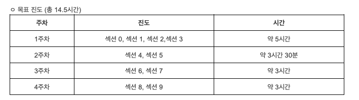

# HunHunJS_Study

[훈훈한 Javascript 강의](https://www.inflearn.com/course/%ED%9B%88%ED%9B%88%ED%95%9C-%EC%9E%90%EB%B0%94%EC%8A%A4%ED%81%AC%EB%A6%BD%ED%8A%B8-%EC%BD%94%EB%93%9C%EC%BA%A0%ED%94%84/dashboard)
를 기반으로 한 오프라인 스터디

 

[학습자료](https://dingco.notion.site/dingco/Javascript-030e34c8d4b54f7a860f3691b75e315a)
[학습자료](https://www.vanillajavascriptprojects.com/)
 

 
 
 

- 각자 정리하고 새로 알게된 내용 공유
- 각 세션에 해당하는 연습문제 풀어오기